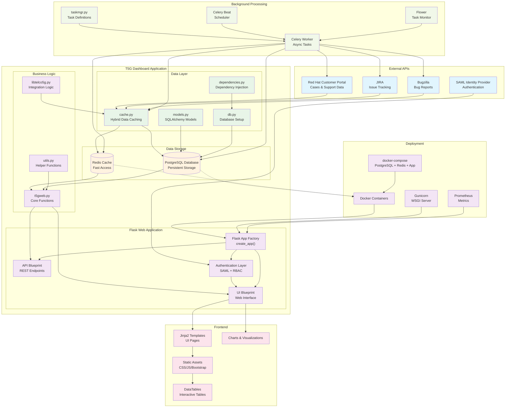
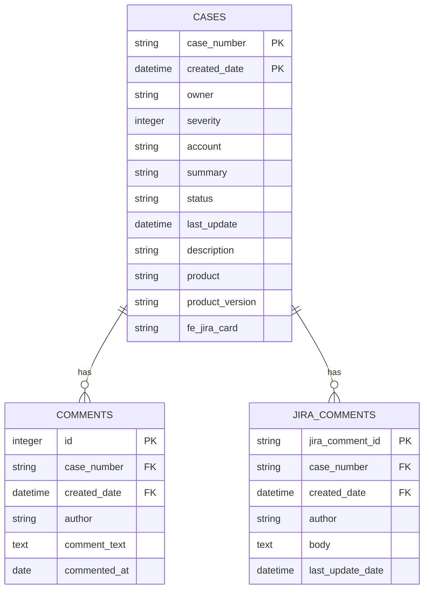

# T5G Field Support Team Utils - PostgreSQL Architecture Diagram

## System Overview
This diagram illustrates the updated architecture with PostgreSQL integration, showing the hybrid Redis + PostgreSQL data storage approach for enhanced persistence and data integrity.

## Updated Architecture Diagram



## Key Architectural Changes

### PostgreSQL Integration
- **Hybrid Storage Model**: Data stored in both Redis (caching) and PostgreSQL (persistence)
- **SQLAlchemy Models**: Structured data models for Cases, Comments, and JIRA Comments
- **Database Health Checks**: PostgreSQL health monitoring in docker-compose
- **Dependency Injection**: Proper database session management

### Data Models


### Benefits of PostgreSQL Integration

#### **Data Persistence**
- **Durable Storage**: Data survives container restarts
- **ACID Compliance**: Reliable transactions and data integrity
- **Backup & Recovery**: Standard PostgreSQL backup procedures
- **Audit Trail**: Full history of data changes

#### **Performance Optimisation**
- **Redis for Speed**: Sub-millisecond access for frequent queries
- **PostgreSQL for Complex Queries**: Relational queries and reporting
- **Dual Write Strategy**: Best of both worlds - speed and persistence

#### **Data Relationships**
- **Foreign Key Constraints**: Data integrity between tables
- **Normalised Structure**: Efficient storage and querying
- **Comment History**: Full comment tracking for cases and JIRA items

### Docker Compose Updates

```yaml
postgresql:
  image: docker.io/postgres:latest
  environment:
    - POSTGRES_USER=postgres
    - POSTGRES_PASSWORD=secret
    - POSTGRES_DB=dashboard
  healthcheck:
    test: ["CMD-SHELL", "pg_isready -U postgres"]
    interval: 5s
    timeout: 5s
    retries: 5
  ports:
   - "5432:5432"
```

### Dependencies Added
- **SQLAlchemy**: ORM for database operations
- **psycopg2-binary**: PostgreSQL adapter
- **Health Checks**: Service dependency management

## How to View This Diagram

### Option 1: Mermaid Live Editor (Recommended)
1. Go to https://mermaid.live/
2. Copy the mermaid code block above
3. Paste it into the editor for instant rendering

### Option 2: VS Code
1. Install "Markdown Preview Mermaid Support" extension
2. Open this file in VS Code
3. Use Ctrl+Shift+V to preview

### Option 3: GitHub/GitLab
Push this file to view with automatic Mermaid rendering 