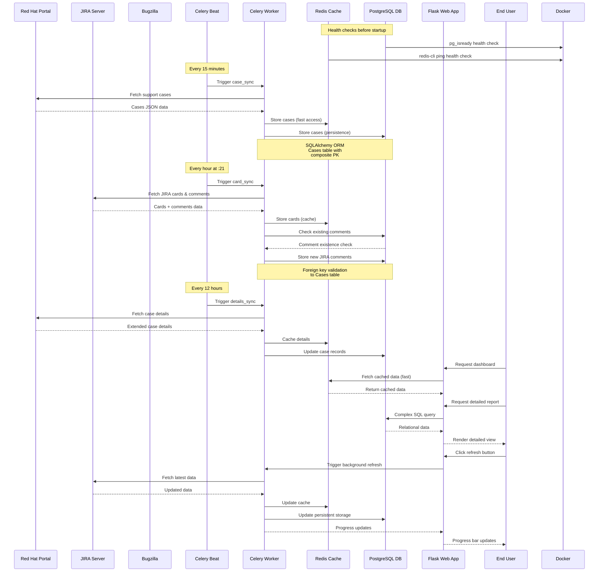
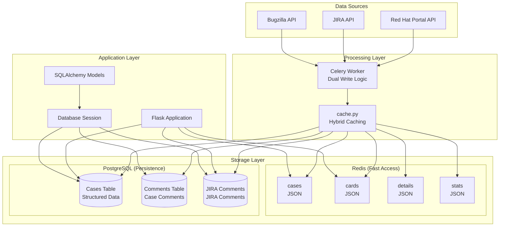
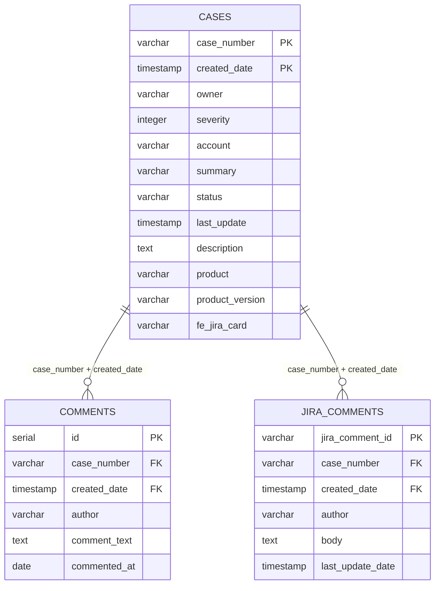
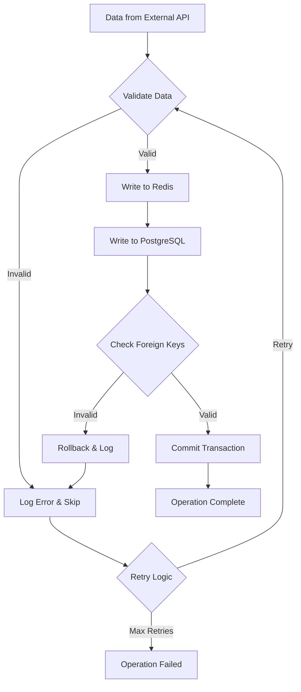
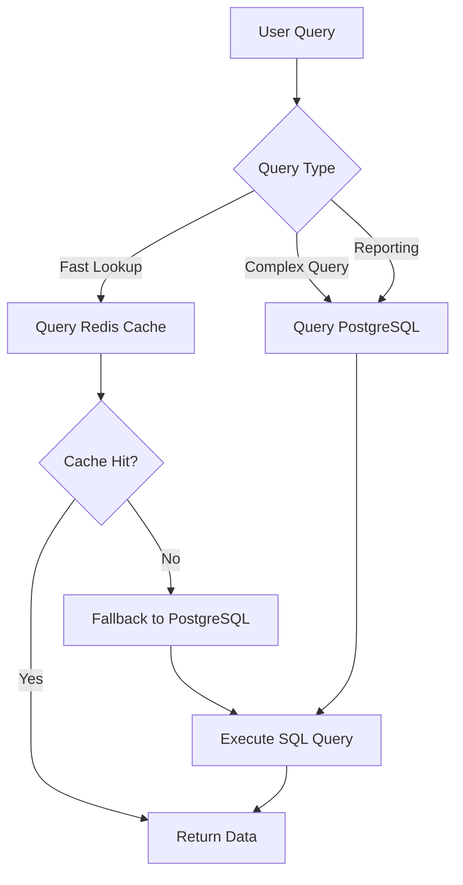
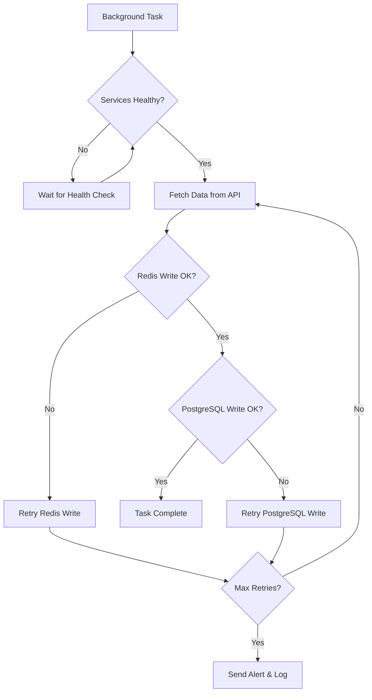

# T5G PostgreSQL Data Flow and Synchronisation Process

## Data Synchronisation Flow with PostgreSQL

This diagram shows the updated data flow with PostgreSQL integration, demonstrating the hybrid Redis + PostgreSQL storage approach.

## Updated Synchronisation Schedule

| Data Type | Frequency | Redis Storage | PostgreSQL Storage | Purpose |
|-----------|-----------|---------------|-------------------|---------|
| **Cases** | Every 15 minutes | ✅ JSON Cache | ✅ Cases Table | Fast access + persistence |
| **Cards** | Every hour (:21) | ✅ JSON Cache | ❌ | JIRA card status |
| **JIRA Comments** | Every hour (:21) | ✅ In cards JSON | ✅ JiraComment Table | Comment persistence + relationships |
| **Details** | Every 12 hours | ✅ JSON Cache | ✅ Cases Table Update | Extended case information |
| **Issues** | Every 12 hours | ✅ JSON Cache | ❌ | Bug tracking updates |
| **Stats** | Daily (4:40 AM) | ✅ JSON Cache | ❌ | Generate metrics |

## Hybrid Storage Architecture

## Database Schema with Relationships

## Data Consistency Strategy

### Write Operations

### Read Operations

## Performance Benefits

### Dual Storage Advantages
- **Redis Benefits**: Sub-millisecond response times for frequent queries
- **PostgreSQL Benefits**: Complex queries, joins, and data integrity
- **Resilience**: Data persistence across container restarts
- **Scalability**: Optimised storage for different use cases

### Health Monitoring
- **PostgreSQL Health**: `pg_isready` checks database availability
- **Redis Health**: `redis-cli ping` verifies cache connectivity
- **Service Dependencies**: All services wait for database health checks

### Data Integrity Features
- **ACID Transactions**: PostgreSQL ensures data consistency
- **Foreign Key Constraints**: Maintains referential integrity
- **Composite Primary Keys**: Handles duplicate case numbers with different creation dates
- **Audit Trail**: Full history preserved in PostgreSQL

## Error Handling and Recovery

## Migration Benefits

### From Redis-Only to Hybrid Model
1. **Data Durability**: Survive container restarts and crashes
2. **Query Flexibility**: SQL queries for complex reporting
3. **Data Relationships**: Proper foreign key relationships
4. **Backup Strategy**: Standard PostgreSQL backup procedures
5. **Audit Capabilities**: Complete data change history
6. **Performance**: Best of both worlds - speed + persistence

This hybrid approach maintains the original performance characteristics whilst adding robust data persistence and relationship management capabilities. 