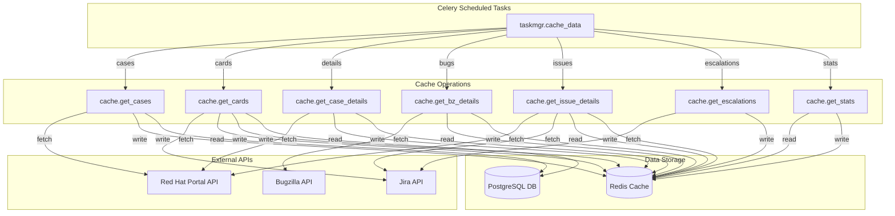
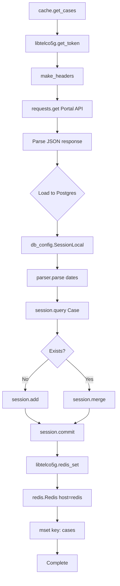
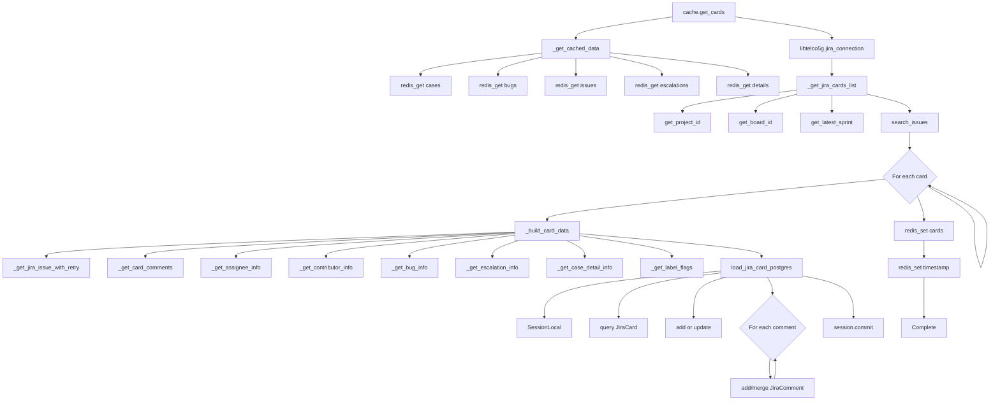
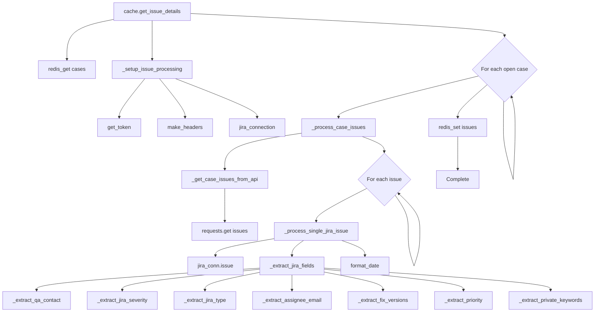
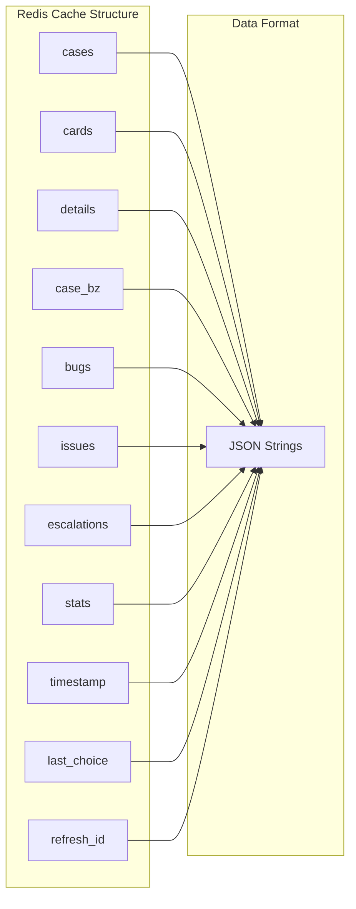
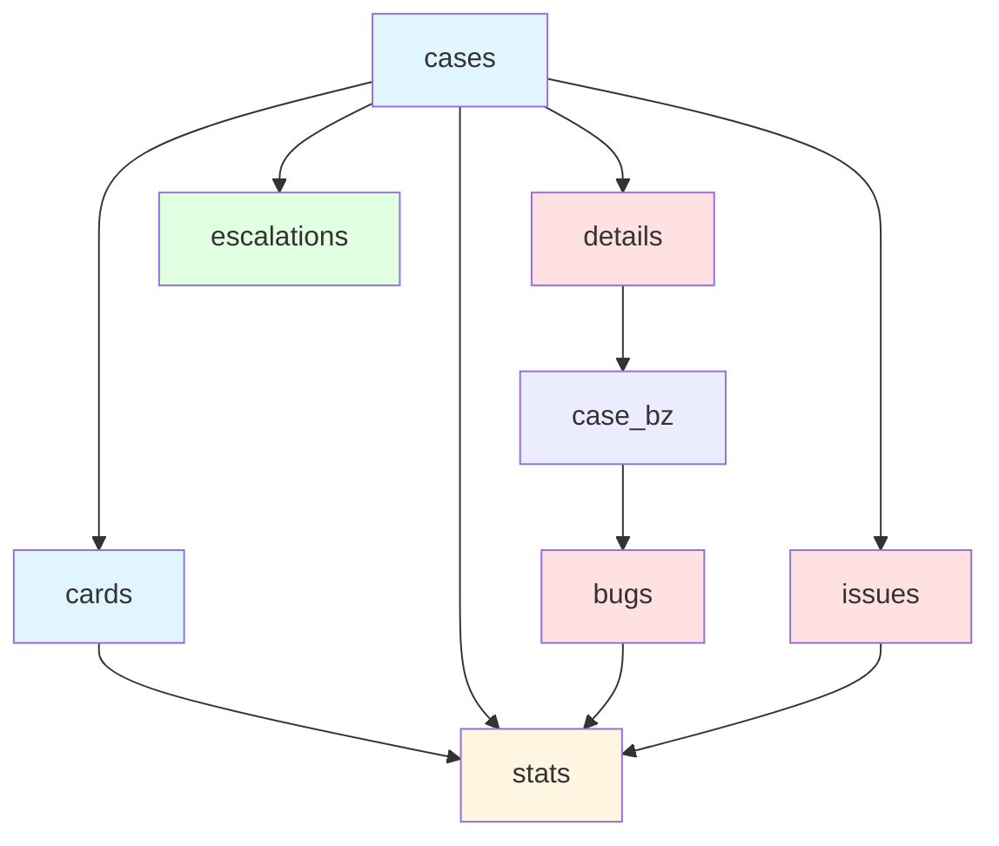
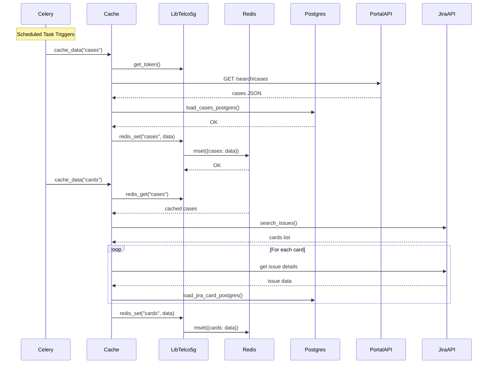
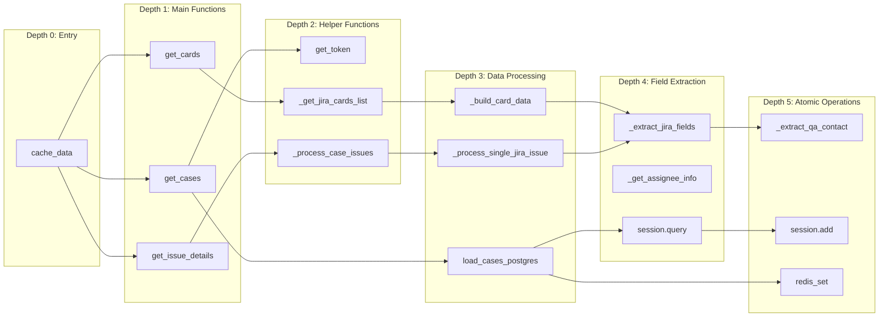

# Redis Data Loading Visualization

## Architecture Overview



## Detailed Call Flow: Cases to Redis



## Detailed Call Flow: Cards to Redis



## Detailed Call Flow: Issues to Redis



## Data Flow Timeline

```mermaid
gantt
    title Redis Data Loading Schedule
    dateFormat HH:mm
    axisFormat %H:%M

    section Every Hour
    Cases (every 15 min) :milestone, m1, 00:00, 0min
    Cases (every 15 min) :milestone, m2, 00:15, 0min
    Cases (every 15 min) :milestone, m3, 00:30, 0min
    Cases (every 15 min) :milestone, m4, 00:45, 0min
    Cards (every hour :21) :milestone, m5, 00:21, 0min

    section Twice Daily
    Details (:24) :milestone, m6, 00:24, 0min
    Details (:24) :milestone, m7, 12:24, 0min
    Bugs (:48) :milestone, m8, 00:48, 0min
    Bugs (:48) :milestone, m9, 12:48, 0min
    Issues (:54) :milestone, m10, 00:54, 0min
    Issues (:54) :milestone, m11, 12:54, 0min

    section Every 2 Hours
    Escalations (:37) :milestone, m12, 00:37, 0min
    Escalations (:37) :milestone, m13, 02:37, 0min

    section Daily
    Stats (04:40) :milestone, m14, 04:40, 0min
```

## Redis Keys and Data Structure



## Dependencies Between Data Types



## Component Interaction Sequence



## Function Call Depth Analysis


