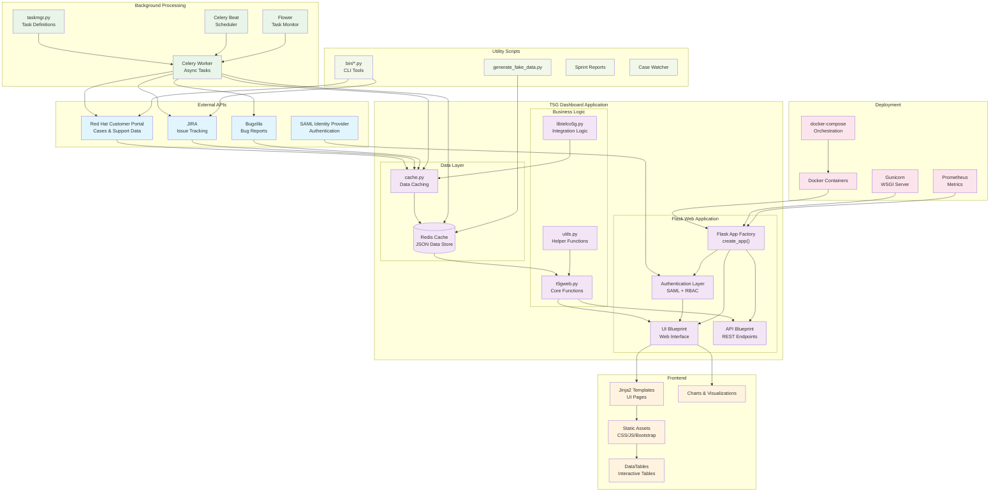

# T5G Field Support Team Utils - Architecture Diagram

## System Overview
This diagram illustrates the complete architecture of the T5G Field Support Team dashboard application, showing data flow, component relationships, and system integrations.

## Architecture Diagram

## Component Details

### External APIs (Blue)
- **Red Hat Customer Portal**: Source of support cases and customer data
- **JIRA**: Issue tracking and project management system
- **Bugzilla**: Bug tracking and resolution system
- **SAML Identity Provider**: Authentication and authorization

### Core Application (Purple)
- **Flask App Factory**: Application initialization and configuration
- **UI Blueprint**: Web interface and user-facing pages
- **API Blueprint**: REST endpoints for data access
- **Authentication Layer**: SAML SSO with role-based access control
- **Business Logic**: Core application functionality and data processing
- **Data Layer**: Caching system with Redis backend

### Background Processing (Green)
- **Celery Worker**: Asynchronous task execution
- **Celery Beat**: Scheduled task management
- **Flower**: Task monitoring and management interface
- **Task Manager**: Task definitions and scheduling logic

### Frontend (Orange)
- **Jinja2 Templates**: Server-side HTML templating
- **Static Assets**: CSS, JavaScript, and Bootstrap framework
- **DataTables**: Interactive data tables with sorting/filtering
- **Charts**: Data visualization and statistics

### Deployment (Pink)
- **Docker Containers**: Application containerization
- **docker-compose**: Development environment orchestration
- **Gunicorn**: WSGI server for production deployment
- **Prometheus**: Metrics collection and monitoring

### Utility Scripts (Light Green)
- **CLI Tools**: Command-line utilities in bin/ directory
- **Fake Data Generator**: Development and testing data creation
- **Sprint Reports**: Automated reporting tools
- **Case Watcher**: Monitoring and notification utilities

## Data Flow

1. **External APIs** feed data into the **Cache Layer** via scheduled background tasks
2. **Redis** stores cached data in JSON format for fast access
3. **Business Logic** processes cached data for presentation
4. **UI/API** serve data to users through web interface or REST endpoints
5. **Background Tasks** run periodic synchronization and maintenance operations

## Key Features

- **Real-time Data Synchronization**: Automated updates from multiple sources
- **Scalable Architecture**: Microservices approach with background processing
- **Responsive UI**: Modern web interface with interactive components
- **Comprehensive Monitoring**: Built-in metrics and task monitoring
- **Development-Friendly**: Docker-based development environment

## Deployment Architecture

The application uses a containerized architecture with:
- **Web Container**: Flask application with Gunicorn
- **Worker Container**: Celery background tasks
- **Scheduler Container**: Celery Beat for periodic tasks
- **Cache Container**: Redis for data storage
- **Monitor Container**: Flower for task monitoring

## Security

- **SAML Authentication**: Enterprise SSO integration
- **Role-Based Access Control**: Fine-grained permissions
- **API Token Management**: Secure external API access
- **Environment Configuration**: Sensitive data through environment variables 