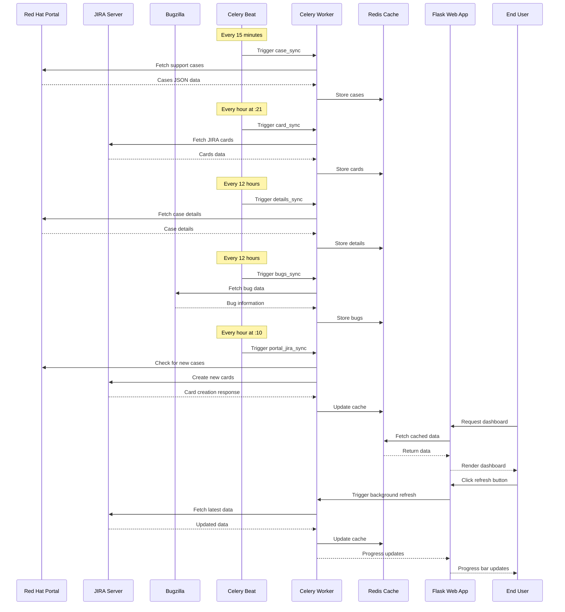
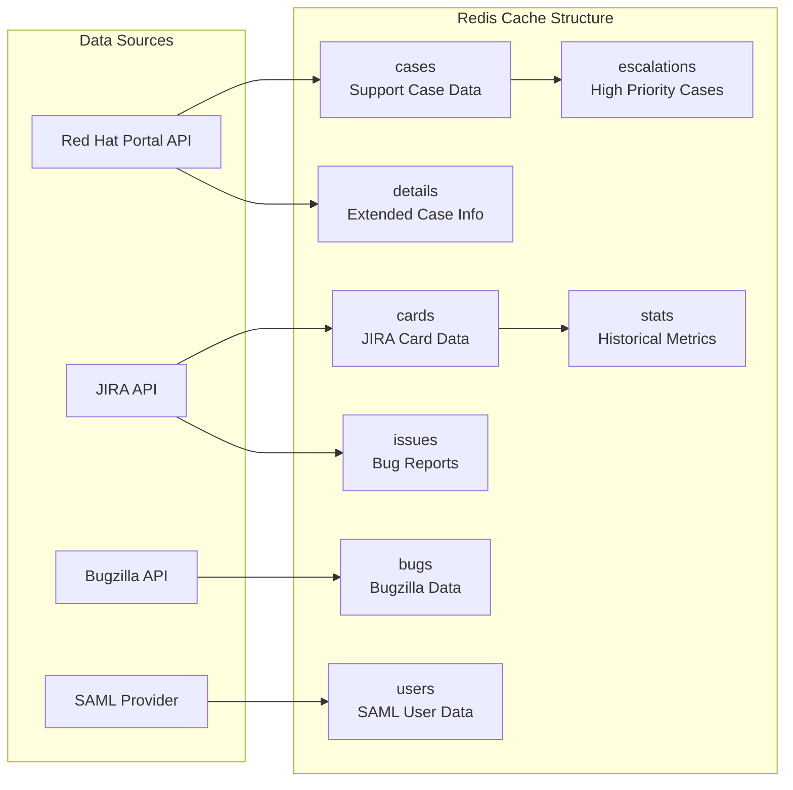
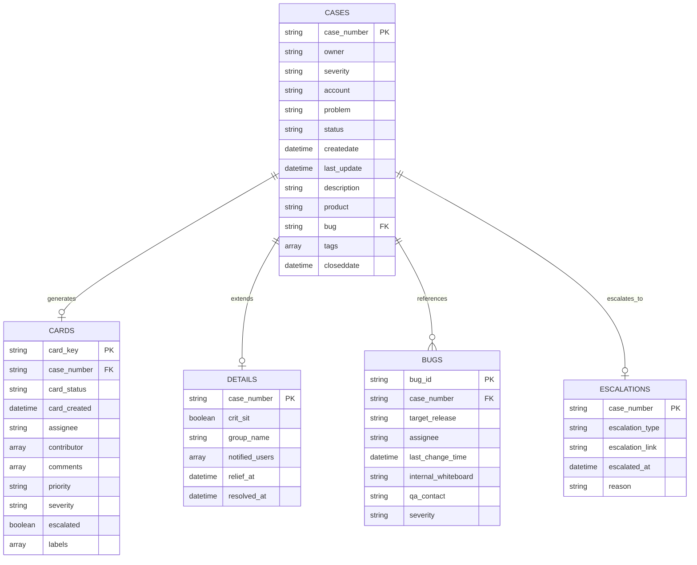
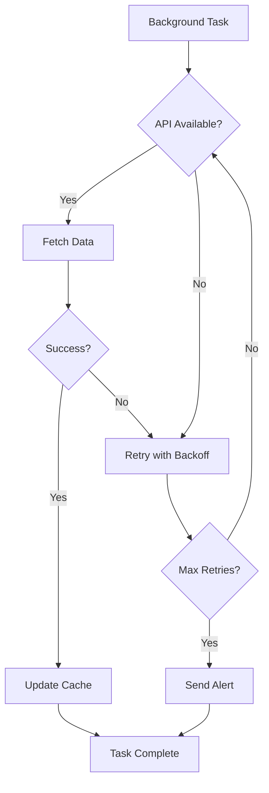

# T5G Data Flow and Synchronization Process

## Data Synchronization Flow

This diagram shows how data flows through the T5G system and the timing of various synchronization processes.

## Synchronization Schedule

| Data Type | Frequency | Purpose |
|-----------|-----------|---------|
| **Cases** | Every 15 minutes | Keep support cases current |
| **Cards** | Every hour (:21) | Update JIRA ticket status |
| **Details** | Every 12 hours | Extended case information |
| **Issues** | Every 12 hours | Bug tracking updates |
| **Bugs** | Every 12 hours | Bugzilla synchronization |
| **Escalations** | Every 2 hours | High-priority monitoring |
| **Stats** | Daily (4:40 AM) | Generate metrics |
| **Portal→JIRA Sync** | Every hour (:10) | Create new JIRA cards |

## Cache Strategy

## Data Relationships

## Performance Considerations

### Caching Benefits
- **Reduced API Calls**: Cached data reduces external API load
- **Fast Response Times**: Redis provides sub-millisecond data access
- **Offline Capability**: Dashboard works even if external APIs are down
- **Concurrent Access**: Multiple users can access cached data simultaneously

### Background Processing
- **Non-blocking Updates**: Data synchronization doesn't impact user experience
- **Scalable Workers**: Multiple Celery workers can process tasks in parallel
- **Retry Logic**: Failed tasks are automatically retried with backoff
- **Progress Tracking**: Real-time progress updates for manual refreshes

### Data Consistency
- **Distributed Locking**: Prevents concurrent cache updates
- **Atomic Operations**: Redis operations ensure data integrity
- **Timestamping**: All cached data includes last update timestamps
- **Conflict Resolution**: Newer data always overwrites older data

## Error Handling

## Monitoring and Alerting

- **Flower Dashboard**: Real-time task monitoring
- **Prometheus Metrics**: Application performance metrics
- **Email Alerts**: Notification for high-priority issues
- **Slack Integration**: Team notifications for critical events
- **Health Checks**: Regular system health monitoring 